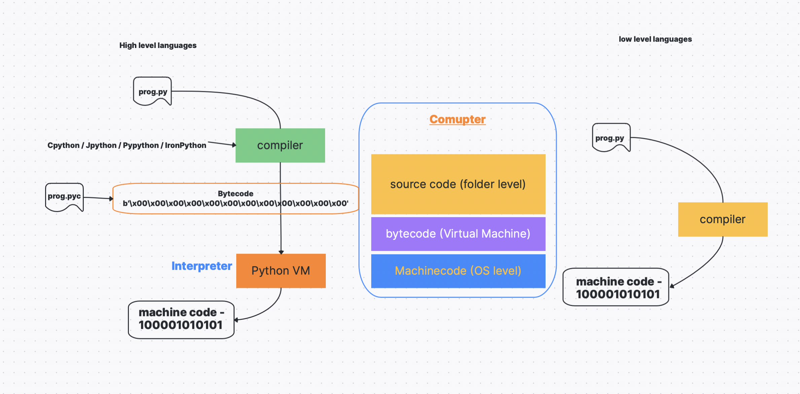

# What is Python ?

    Popular Programming language created by Guido Van Rossum, released in 1991.

# Used for 

    Web development (server-side)
    software development
        API
        Machine Learning Models
        Device Software
    system scripts

    can perform complex mathematics and handle big-data.

# why ?

    Cross platform support.
    simple syntax similar to English language 
    Can develop with fewer lines 
    Procedural way, object-oriented way or functional way 

# How Does python work ?

Python runs on python virtual machine interpreter to execute its bytecodes.
Unlike other languages python doesnt generate machine code. it generates 
bytecode after compilation and we need interpreter to execute the bytecodes.

if you have a file called "prog.py"

step 1 - compiler reads the source file and check for any syntax
        errors, if found any stops the execution and displays the error message.

step 2 - if no error found compiler translates source code to bytecode.

step 3 - byte code will be executed through python virtual machine (interpreter)
        this pvm takes care of the conversion of bytecode to machine code.

# sourcecode - bytecode - machinecode

sourcecode: (Human understandable code)
    Code which is in high-level language.

bytecode :
    Code which results from compilation of source code.
    Virtual machines processes bytecodes.
    Interpreter translates bytecode to machine code.

    Any system which has virtualmachines irrespective of OS 
    can run the byte code thus makes it independent of OS.

Machinecode: (binary formatted code)
    Code that Machine (CPU) can read and understand directly and process it.
    We get to this machinecode stage after interpretation or compilation. 

# How Python references variables

# garbage collection

what is garbage collection ?

    Other languages such as C, the memory allocation 
    can happen manually. Where as in Python user dont have access to 
    the Python Heap space. 
        All those unsed or unreferenced objects in python 
        will get deleted by this garbage collector by using
        reference counting mechanism
    When number of object references goes to zero, then it deletes the object.

    